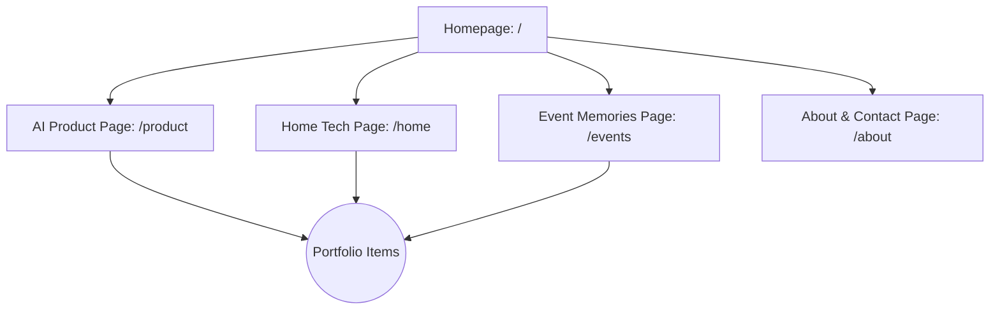
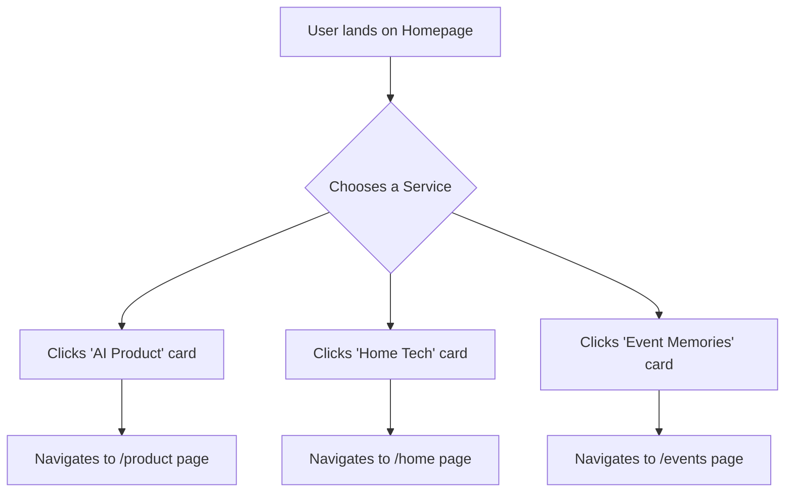
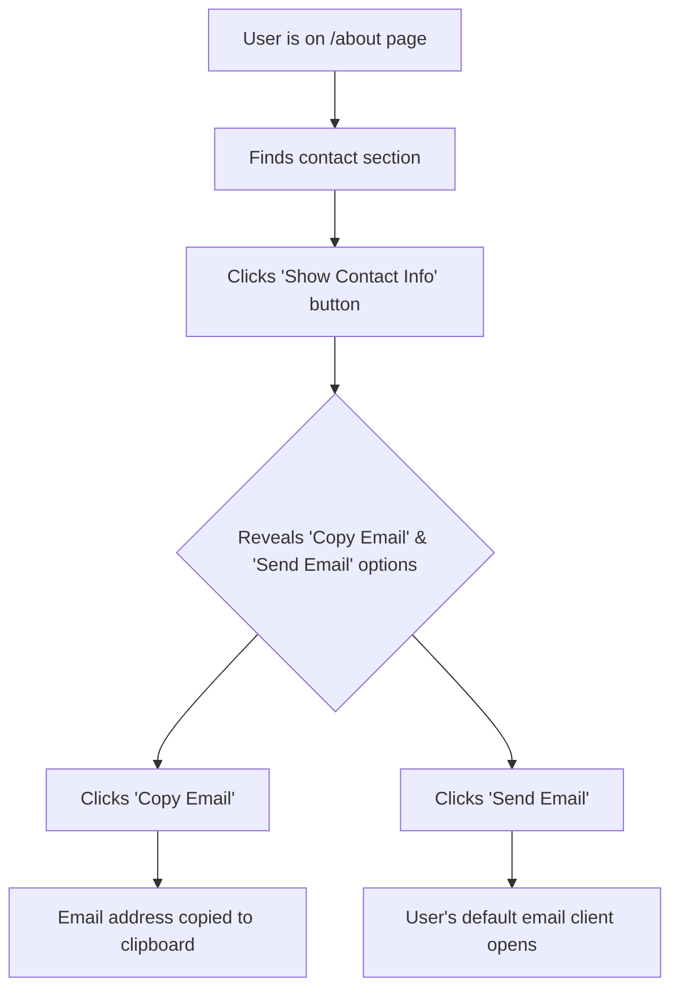

# Miovox Studio UI/UX Specification

## Overall Design Strategy: A Phased Approach

- **Phase 1 (MVP): The "Standard Kit"**

  - The initial launch will be built using our approved 'Standard Kit': `Playfair Display`/`Nunito Sans` fonts, the official brand color palette, and `shadcn/ui` components. The focus will be on a clean, premium, and highly usable implementation of the approved layouts (staggered grid, etc.).

- **Phase 2 (Post-MVP Vision): The "Avant-Garde" Enhancements**
  - Future iterations will evolve the site towards the "Dynamic Canvas Portal" concept. This includes introducing subtle animations and generative art to the homepage panels and carrying a more immersive, themed aesthetic into each of the child pages.

---

## Information Architecture (IA)

### Site Map / Screen Inventory

A visual sitemap defines the hierarchy of pages: a central Homepage linking to three co-equal service pages (Product, Home, Events) and an About/Contact page. Portfolio items are accessible from within each relevant service page.



### Navigation Structure

- **Primary Navigation (Homepage):** The Homepage itself acts as the primary navigation hub (our "Brand Portal"). Its main purpose is to direct users to one of the three service pillars or the about page.
- **Sub-site Navigation:** Once a user enters a service section (e.g., `/product`), the header navigation will be minimal, primarily offering a clear and easy way to return to the main Homepage. This reinforces the feeling of being in a dedicated "sub-site."
- **Footer Navigation:** The global footer will contain a full set of links to all main pages (Home, About, Product, Home, Events), ensuring a user is never lost and can always navigate to another section.

---

## User Flows

### Visitor Explores a Service

- **User Goal:** To understand one of Miovox Studio's specific service offerings and see if it meets their needs.
- **Entry Points:** Direct link, organic search, or from the Homepage Brand Portal.
- **Success Criteria:** The visitor successfully navigates to a specific service page and understands the value proposition.

- **Flow Diagram:**



### Visitor Reviews Portfolio

- **User Goal:** To view examples of completed work to validate the quality and expertise of Miovox Studio.
- **Entry Points:** From any of the three main service pages.
- **Success Criteria:** The visitor easily finds and views portfolio items relevant to the service they are interested in.
- **Flow Diagram:**

```mermaid
graph TD
    A[User is on a Service Page] --> B[Scrolls to Portfolio section];
    B --> C[Reviews project thumbnails];
    C --> D[Clicks on a specific project];
    D --> E[https://github.com/rtfd/readthedocs.org/issues/1440](https://github.com/rtfd/readthedocs.org/issues/1440);
    E --> F[Modal/Overlay opens with project details];
    F --> G[User closes Modal];
    G --> H[https://www.law.cornell.edu/wex/return_of_service](https://www.law.cornell.edu/wex/return_of_service);
    H --> C;
```

- **Notes & Key Decisions:**
  - **URL-Addressable Modals:** To make projects shareable and feel modern, clicking a portfolio item will update the URL (e.g., `/product/project-name`). This will be handled by the application's router to display the project's details in a modal overlay.
  - **Empty State:** If a service category has no portfolio items, the entire portfolio section will be hidden on that page.

### Visitor Makes Contact

- **User Goal:** To find and use the contact information to reach out to Miovox Studio with an inquiry.
- **Entry Points:** From any page on the site, typically via the footer or a direct link to the `/about` page.
- **Success Criteria:** The visitor can successfully copy the contact email or open their email client via the interactive contact element.
- **Flow Diagram:**



- **Notes & Key Decisions:**
  - **Anti-Spam Interaction:** The contact email will be hidden behind a user-activated button to prevent automated scraping.
  - **Interaction Design:** The revealed contact element will consist of two distinct buttons: a primary text button labeled "Send Email" (`mailto:` link) and a secondary icon-only button using a "copy" icon.

---

## Wireframes & Mockups

- **Process:** The project will follow a rapid, AI-first design process. Formal low-fidelity wireframes will be skipped. The v0-generated output will serve as the initial layout baseline. Further layout refinements will be handled via detailed, iterative AI prompting and direct code refinement.

---

## Component Library / Design System

- **Approach:** The project will leverage a modern, headless component library to accelerate development and ensure accessibility.
- **Selected Library:** **shadcn/ui**. Components will be added to the project on an as-needed basis using its CLI, allowing for full ownership and direct styling with Tailwind CSS.

---

## Branding & Style Guide

### Typography

- **Direction:** Refined Classic. The goal is to combine a high-character, elegant heading font with a clean, highly readable body font.
- **Primary Heading Font:** Playfair Display
- **Primary Body Font:** Nunito Sans
- **Status:** Initial selection, to be confirmed with visual mockups.

### Color Palette

| Color Type          | Hex Code  | Usage                                     |
| :------------------ | :-------- | :---------------------------------------- |
| Primary             | `#271848` | Main text (on light backgrounds)          |
| Primary (Dark Mode) | `#E1D9F2` | All text (on dark backgrounds)            |
| Secondary           | `#6B7280` | Sub-headings, secondary text (light mode) |
| Accent              | `#3F93CF` | Links, buttons, highlights                |
| Success             | `#22C55E` | Confirmation messages                     |
| Warning             | `#F97316` | Important notices                         |
| Error               | `#EF4444` | Error messages                            |
| Neutral             | `#F9FAFB` | Light backgrounds, borders                |

---

## Accessibility Requirements

- **Standard:** WCAG 2.1 Level AA.
- **Key Requirements:**
  - **Visual:** Color contrast of at least 4.5:1, visible keyboard focus indicators, text resizable to 200%.
  - **Interaction:** Full keyboard navigability, screen reader support, touch targets of at least 44x44 CSS pixels.
  - **Content:** Descriptive `alt` text for all meaningful images and a logical heading structure.
- **Testing Strategy:** A combination of automated tools (Axe, Lighthouse) and manual keyboard/screen reader testing.

---

## Responsiveness Strategy

### Breakpoints

| Breakpoint       | Min Width | Target Devices            |
| :--------------- | :-------- | :------------------------ |
| Mobile (default) | 0px       | Phones                    |
| Tablet           | 768px     | iPads, tablets            |
| Desktop          | 1024px    | Laptops, desktop monitors |
| Wide             | 1920px    | Full HD+ monitors         |

### Adaptation Patterns

- **Layout Changes:** The homepage "Brand Portal" will be a single-column stack on mobile, transitioning to a three-column staggered grid from the tablet breakpoint (768px) upwards.
- **Full-Bleed Sections with Contained Content:** Section backgrounds will extend to the full viewport width. The content within will be constrained to a maximum width of 1920px and centered.

---

## Animation & Micro-interactions

### Motion Principles

- **Subtle & Purposeful:** Animations should be understated and serve a clear purpose.
- **Responsive & Performant:** Animations must be smooth (targeting 60fps) and implemented with modern CSS properties.
- **Consistent:** The speed and easing of animations will be consistent across the site.
- **Adaptable & Scalable:** Initial animations will be implemented in a modular way to allow for future evolution towards the "Dynamic Canvas" concept.

### Key Animations

- **Service Card Hover:** Gentle scaling and shadow enhancement on hover.
- **Contact Info Reveal:** Smooth fade-in of contact buttons on click.
- **Page Load:** Subtle fade-in of content on initial load.

---

## Performance Considerations

### Performance Goals

- **Core Web Vitals:** Aim for "Good" scores in LCP, INP, and CLS.
- **Interaction Response:** Feedback in under 100ms.
- **Animation FPS:** Target a consistent 60fps.

### Design Strategies

- **Static Site Generation (SSG):** The primary strategy for fast load times.
- **Image Optimization:** Use modern formats (WebP/AVIF) and automatic resizing via the Next.js `<Image>` component.
- **Code Splitting:** Automatic per-page code splitting via Next.js.
- **Minimal Third-Party Scripts:** Keep third-party scripts to an absolute minimum for the MVP.
